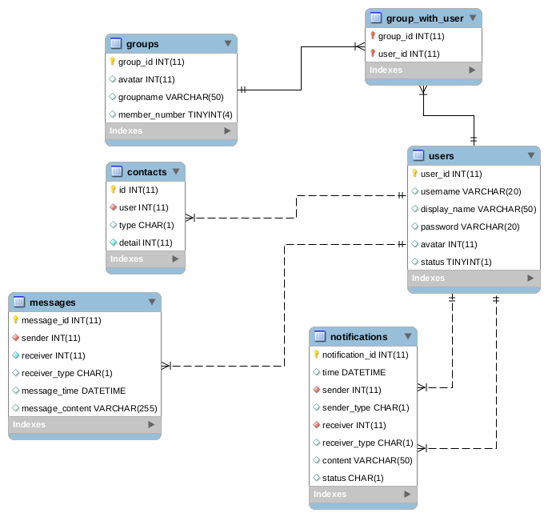
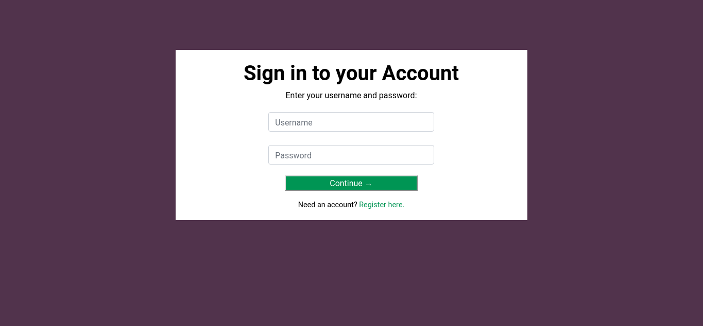

- [1. Nội dung](#1-N%E1%BB%99i-dung)
  - [1.1. Khái niệm về database](#11-Kh%C3%A1i-ni%E1%BB%87m-v%E1%BB%81-database)
  - [1.2. SQL (Structure Query Language)](#12-SQL-Structure-Query-Language)
  - [1.3. So sánh với NoSQL](#13-So-s%C3%A1nh-v%E1%BB%9Bi-NoSQL)
    - [1.3.1. SQL tables và NoSQL Documents](#131-SQL-tables-v%C3%A0-NoSQL-Documents)
    - [1.3.2. SQL schema và NoSQL Schemaless](#132-SQL-schema-v%C3%A0-NoSQL-Schemaless)
    - [1.3.3. SQL Normalization vs NoSQL Denormalization](#133-SQL-Normalization-vs-NoSQL-Denormalization)
    - [1.3.4. SQL Relational JOIN vs NoSQL](#134-SQL-Relational-JOIN-vs-NoSQL)
    - [1.3.5. SQL vs NoSQL Transactions](#135-SQL-vs-NoSQL-Transactions)
    - [1.3.6. SQL vs NoSQL Performance](#136-SQL-vs-NoSQL-Performance)
    - [1.3.7. Bảng so sánh](#137-B%E1%BA%A3ng-so-s%C3%A1nh)
  - [1.4. Khi nào dùng SQL - NoSQL ?](#14-Khi-n%C3%A0o-d%C3%B9ng-SQL---NoSQL)
    - [1.4.1. Dùng SQL?](#141-D%C3%B9ng-SQL)
    - [1.4.2. Dùng NoSQL?](#142-D%C3%B9ng-NoSQL)
  - [1.5. MySQL](#15-MySQL)
  - [1.6. Redis](#16-Redis)
  - [1.7. Bài tập Schema cho ứng dụng Chat](#17-B%C3%A0i-t%E1%BA%ADp-Schema-cho-%E1%BB%A9ng-d%E1%BB%A5ng-Chat)
- [2. Nguồn tham khảo](#2-Ngu%E1%BB%93n-tham-kh%E1%BA%A3o)

# 1. Nội dung

## 1.1. Khái niệm về database

-   Database là môt tập hợp có tổ chức của dữ liệu, thường được lưu trữ và truy cập từ hệ thống máy tính. Khi database trở nên phức tạp hơn, chúng thường được phát triển bằng cách sử dụng các kỹ thuật thiết kế (modeling techniques) và mô hình hóa chính thức (formal design)
-   Database management system (DBMS) là phần mềm tương tác với người dùng end user, applications, và chính database nó để nắm bắt và phân tích dữ liệu

-   DBMS và các ứng dụng liên quan được xem là database system. Thường thì cụm từ "database" được sử dụng với bất cứ DBMS nào, database system hay các ứng dụng liên quan đến database

-   Computer scientist phân loại DBMS theo các Database model. Relational database thịnh hành ở 1980s, đây là loại database có hàng và cột tạo thành các table, chủ yếu dùng SQL để viết và truy vấn data. Vào 2000s, non-relational database trở nên phổ biến, được xem là NoSQL

-   DBMS hiện tại cung cấp nhiều functions cho phép quản lý database và được phân loại thành 4 nhóm chức năng:
    -   **Data definition**: Thêm, sửa, xóa định nghĩa tổ chức data như cấu trúc bảng
    -   **Update**: thêm, sửa, xóa các trường dữ liệu
    -   **Retrieval**: cung cấp thông tin dưới dạng có thể dùng trực tiếp hay xử lý sau bởi các ứng dụng. Dữ liệu được truy xuất (retrieved) sẵn sàng theo một dạng cơ bản cũng như khi nó lưu trong database hoặc dạng mới bằng cách liên kết các bảng
    -   **Administration**: đăng ký và giám sát người dùng, thực thi bảo mật dữ liệu, giám sát performance, đảm bảo data toàn vẹn, đối phó với kiểm soát đồng thời (concurrency) và khôi phục thông tin khi hệ thống bị lỗi
-   Ở mức vật lý, database servers được dùng để  lưu trữ một database thực sự và chạy chỉ trên DBMS và các software liên quan. Database servers thường dùng máy tính đa tiến trình, với một lượng bộ nhớ lớn với cơ chế [RAID](https://en.wikipedia.org/wiki/RAID) cho dữ liệu bền vững. RAID được dùng để phục hồi dữ liệu nếu bất cứ đĩa cứng nào bị hỏng. Phần cứng tăng tốc database sẽ kết nối tới một hoặc nhiều server thông qua kênh truyền tốc độ cao và cũng sử dụng một lượng lớn bộ nhớ cho việc xây dựng môi trường xử lý các tiến trình. DBMSs được hiểu như là quả tim của hầu hết các hệ cơ sở dữ liệu. Chúng được xây dựng xung quanh cơ chế đa tiến trình và kết nối với mạng của hệ điều hành
  
-   Phân loại các loại Database: có thể phân loại theo nội dung, phân loại theo nghiệm vụ ứng dụng (kế toán, phim, ngân hàng), phân loại dựa trên khía cạnh kỹ thuật (cấu trúc DB, kiểu interface)
    -   **In-memory database**: DB chủ yếu nằm trong Main memory, được sao lưu bằng các storage đảm bảo không mất dữ liệu. Tốc độ nhanh hơn database lưu trên Disk, được dùng khi yêu cầu thời gian phản hồi nhanh, trong thiết bị mạng viễn thông
    -   **Active database**: bao gồm kiến trúc event-driven,, có thể đáp ứng các điều kiện cả bên trong và bên ngoài DB. Có thể dùng để giám sát an ninh, báo động, thống kê thu thập và chứng thực. Nhiều database cung cấp tính chất của database active theo dạng database triggers
    -   **Cloud database**: dựa trên cloud technology, cả DB và DBMS đều remotely, "in the cloud", trong khi ứng dụng của nó được phát triển bởi dev, và được sử dụng bởi end user thông qua web browser và Open APIs 

    -   **Data warehouse**: lưu trữ dữ liệu từ cơ sở dữ liệu hoạt động và thường từ các nguồn bên ngoài như các công ty nghiên cứu thị trường. Kho trở thành nguồn dữ liệu trung tâm để người quản lý và người dùng cuối khác sử dụng, những người có thể không có quyền truy cập vào dữ liệu vận hành. Ví dụ: dữ liệu bán hàng có thể được tổng hợp thành tổng số hàng tuần và được chuyển đổi từ mã sản phẩm nội bộ sang sử dụng UPC để có thể so sánh chúng với dữ liệu ACNielsen. Một số thành phần cơ bản và thiết yếu của kho dữ liệu bao gồm trích xuất, phân tích và khai thác dữ liệu, chuyển đổi, tải và quản lý dữ liệu để làm cho chúng có sẵn để sử dụng tiếp

    -   **A deductive database**: combines logic programming with a relational database.
    -   [**Others**](https://en.wikipedia.org/wiki/Database#Classification)


## 1.2. SQL (Structure Query Language)

-   SQL chính là viết tắt của Structured Query language, được phát âm là "S-Q-L" hoặc đôi khi là "See-Quel" là ngôn ngữ chuẩn để xử lý Cơ sở dữ liệu quan hệ. Một cơ sở dữ liệu quan hệ xác định các mối quan hệ dưới dạng các bảng.

-   Lập trình SQL có thể được sử dụng hiệu quả để chèn, tìm kiếm, cập nhật, xóa các bản ghi cơ sở dữ liệu.

-   Điều đó không có nghĩa là SQL không thể làm được gì ngoài việc đó. Nó có thể làm rất nhiều thứ bao gồm, nhưng không giới hạn, tối ưu hóa và duy trì cơ sở dữ liệu.

-   Các cơ sở dữ liệu quan hệ như Cơ sở dữ liệu MySQL, Oracle, MS SQL Server, Sybase, vv sử dụng SQL.

Các lệnh **SQL** có thể chia các loại sau:

- DDL (Data Definition Language)
- DML (Data Manipulation Language)
- DQL (Data Query Language)
- DCL (Data Control Language)
- Data administration commands
- Transactional control commands

#### 1.2.0.1. **Defining Database Structures** : 

```
CREATE TABLE
ALTER TABLE
DROP TABLE
CREATE INDEX
ALTER INDEX
DROP INDEX
CREATE VIEW
DROP VIEW
```

#### 1.2.0.2. **Manipulating Data**

```
INSERT
UPDATE
DELETE
```

#### 1.2.0.3. **Selecting Data**

```
 SELECT
```

#### 1.2.0.4. **Data Control Language**

```
ALTER PASSWORD
GRANT
REVOKED
CREATE SYNONYM
```
#### 1.2.0.5. **Data Administration Commands**

```
START AUDIT
STOP AUDIT
```

#### 1.2.0.6. **Transactional Control Commands**

```
COMMIT : Saves database transactions
ROLLBACK : Undoes database transactions
SAVEPOINT : Creates points within groups of transactions in which to ROLLBACK
SET TRANSACTION : Places a name on a transaction
```

#### 1.2.0.7. Các lệnh SQL thông dụng:

**ALTER TABLE** 

```sql
ALTER TABLE table_name 
ADD column_name datatype;
```
`ALTER TABLE` lets you add columns to a table in a database.

**AND**

```sql
SELECT column_name(s)
FROM table_name
WHERE column_1 = value_1
  AND column_2 = value_2;
```

`AND` is an operator that combines two conditions. Both conditions must be true for the row to be included in the result set.

**AS**

```sql
SELECT column_name AS 'Alias'
FROM table_name;
```

`AS` is a keyword in SQL that allows you to rename a column or table using an alias.

**AVG()**

```sql
SELECT AVG(column_name)
FROM table_name;
```

`AVG()` is an aggregate function that returns the average value for a numeric column.

**BETWEEN**

```sql
SELECT column_name(s)
FROM table_name
WHERE column_name BETWEEN value_1 AND value_2;
```

The `BETWEEN` operator is used to filter the result set within a certain range. The values can be numbers, text or dates.

**CASE**

```sql
SELECT column_name,
  CASE
    WHEN condition THEN 'Result_1'
    WHEN condition THEN 'Result_2'
    ELSE 'Result_3'
  END
FROM table_name;
```

`CASE` statements are used to create different outputs (usually in the `SELECT` statement). It is SQL's way of handling if-then logic.


**COUNT()**

```sql
SELECT COUNT(column_name)
FROM table_name;
```

`COUNT()` is a function that takes the name of a column as an argument and counts the number of rows where the column is not `NULL`.

**CREATE TABLE**

```sql
CREATE TABLE table_name (
  column_1 datatype, 
  column_2 datatype, 
  column_3 datatype
);
```

`CREATE TABLE` creates a new table in the database. It allows you to specify the name of the table and the name of each column in the table.


**DELETE**

```sql
DELETE FROM table_name
WHERE some_column = some_value;

```

`DELETE` statements are used to remove rows from a table.

**GROUP BY**

```sql
SELECT column_name, COUNT(*)
FROM table_name
GROUP BY column_name;
```

`GROUP BY` is a clause in SQL that is only used with aggregate functions. It is used in collaboration with the `SELECT` statement to arrange identical data into groups.


**HAVING**

```sql
SELECT column_name, COUNT(*)
FROM table_name
GROUP BY column_name
HAVING COUNT(*) > value;
```

`HAVING` was added to SQL because the WHERE keyword could not be used with aggregate functions.

**INNER JOIN**

```sql
SELECT column_name(s)
FROM table_1
JOIN table_2
  ON table_1.column_name = table_2.column_name;
```
An inner join will combine rows from different tables if the join condition is true.

**INSERT**

```sql
INSERT INTO table_name (column_1, column_2, column_3) 
VALUES (value_1, 'value_2', value_3);

```

`INSERT` statements are used to add a new row to a table.

**IS NULL / IS NOT NULL**

```sql
SELECT column_name(s)
FROM table_name
WHERE column_name IS NULL;
```

`IS NULL` and `IS NOT NULL` are operators used with the `WHERE` clause to test for empty values.


**LIKE**

```sql
SELECT column_name(s)
FROM table_name
WHERE column_name LIKE pattern;

```

`LIKE` is a special operator used with the `WHERE` clause to search for a specific pattern in a column.


**LIMIT**

```sql
SELECT column_name(s)
FROM table_name
LIMIT number;
```

`LIMIT` is a clause that lets you specify the maximum number of rows the result set will have.

**MAX()**

```sql
SELECT MAX(column_name)
FROM table_name;
```

`MAX()` is a function that takes the name of a column as an argument and returns the largest value in that column.

**MIN()**

```sql
SELECT MIN(column_name)
FROM table_name;
```

`MIN()` is a function that takes the name of a column as an argument and returns the smallest value in that column.


**OR**

```sql
SELECT column_name
FROM table_name
WHERE column_name = value_1
   OR column_name = value_2;
```

`OR` is an operator that filters the result set to only include rows where either condition is true.

**ORDER BY**

```sql
SELECT column_name
FROM table_name
ORDER BY column_name ASC | DESC;
```

`ORDER BY` is a clause that indicates you want to sort the result set by a particular column either alphabetically or numerically.


**OUTER JOIN**

```sql
SELECT column_name(s)
FROM table_1
LEFT JOIN table_2
  ON table_1.column_name = table_2.column_name;
```

An outer join will combine rows from different tables even if the join condition is not met. Every row in the left table is returned in the result set, and if the join condition is not met, then NULL values are used to fill in the columns from the right table.

**ROUND()**

```sql
SELECT ROUND(column_name, integer)
FROM table_name;
```
`ROUND()` is a function that takes a column name and an integer as an argument. It rounds the values in the column to the number of decimal places specified by the integer.


**SELECT**

```sql
SELECT column_name 
FROM table_name;
```

`SELECT` statements are used to fetch data from a database. Every query will begin with SELECT.

**SELECT DISTINCT**

```sql
SELECT DISTINCT column_name
FROM table_name;
```

`SELECT DISTINCT` specifies that the statement is going to be a query that returns unique values in the specified column(s).


**SUM**

```sql
SELECT SUM(column_name)
FROM table_name;
```

`SUM()` is a function that takes the name of a column as an argument and returns the sum of all the values in that column.

**UPDATE**

```sql
UPDATE table_name
SET some_column = some_value
WHERE some_column = some_value;
```
`UPDATE` statements allow you to edit rows in a table.

**WHERE**

```sql
SELECT column_name(s)
FROM table_name
WHERE column_name operator value;
```

`WHERE` is a clause that indicates you want to filter the result set to include only rows where the following condition is true.


**WITH**

```sql
WITH temporary_name AS (
   SELECT *
   FROM table_name)
SELECT *
FROM temporary_name
WHERE column_name operator value;
```

`WITH` clause lets you store the result of a query in a temporary table using an alias. You can also define multiple temporary tables using a comma and with one instance of the `WITH` keyword.

The `WITH` clause is also known as common table expression (CTE) and subquery factoring.


## 1.3. So sánh với NoSQL

-   SQL chính là viết tắt của Structured Query language, được phát âm là "S-Q-L" hoặc đôi khi là "See-Quel" là ngôn ngữ chuẩn để xử lý Cơ sở dữ liệu quan hệ. Một cơ sở dữ liệu quan hệ xác định các mối quan hệ dưới dạng các bảng

-   NoSQL là một database management system không quan hệ, không yêu cầu một lược đồ cố định tránh các phép nối, và dễ dàng mở rộng. Cơ sở dữ liệu NoSQL được sử dụng cho các kho dữ liệu phân tán với nhu cầu lưu trữ dữ liệu khổng lồ. NoSQL được sử dụng cho dữ liệu lớn và các ứng dụng web thời gian thực. Ví dụ như các công ty như Twitter, Facebook, Google thu thập hàng terabyte dữ liệu người dùng mỗi ngày.

-   RDBMS truyền thống sử dụng cú pháp SQL để lưu trữ và truy xuất dữ liệu để có thêm thông tin chi tiết. Thay vào đó, một hệ thống cơ sở dữ liệu NoSQL bao gồm một loạt các công nghệ cơ sở dữ liệu có thể lưu trữ dữ liệu có cấu trúc, bán cấu trúc, không có cấu trúc và đa hình.

### 1.3.1. SQL tables và NoSQL Documents

-   SQL databases cung cấp kiểu lưu trữ dữ liệu dưới dạng bảng và các bảng này có quan hệ với nhau. VD thông tin books trong bảng được đặt tên books. Mỗi một row ứng với một record, mỗi column ứng với mỗi field dữ liệu. NoSQL databases lưu trữ dưới dạng JSON dưới dạng field-value từng cặp một.

```json
{
  ISBN: 9780992461225,
  title: "JavaScript: Novice to Ninja",
  author: "Darren Jones",
  format: "ebook",
  price: 29.00
}
```

-   Nó giống như document được lưu trữ trong một collection, tương tự như một bảng trong SQL vậy. Tuy nhiên bạn có thể lưu bất kì dữ liệu nào bạn thích 

```json
{
  ISBN: 9780992461225,
  title: "JavaScript: Novice to Ninja",
  author: "Darren Jones",
  year: 2014,
  format: "ebook",
  price: 29.00,
  description: "Learn JavaScript from scratch!",
  rating: "5/5",
  review: [
    { name: "A Reader", text: "The best JavaScript book I've ever read." },
    { name: "JS Expert", text: "Recommended to novice and expert developers alike." }
  ]
}
```

-   SQL table thì lại tạo ra một mẫu dữ liệu rất chặt chẽ từ datatype, field name, validation, và đó cũng là điểm mấu chốt có thể gây ra những sai lầm. NoSQL thì lại mềm dẽo hơn rất nhiều và có thể lưu ở mọi nơi nên có vẫn có thể gặp vấn đề về nhất quán

### 1.3.2. SQL schema và NoSQL Schemaless

-   Trong SQL databases, ta có thể thêm dữ liệu nếu bạn tạo bảng và field types tương ứng được gọi là schema. Schema chứa nhưng thông tin về database mà bạn đang sử dụng như: primary keys, indexes, relationships ... Do đó schema phải được design và implements đầu tiên. Tuy nhiên nó cũng có thể update sau nhưng những thay đổi lớn sẽ trở lên phức tạp hơn khi nhìn vào file schema.

-   Còn trong NoSQL dữ liệu được add mọi nơi và bất kì lúc nào. VD trong MongoDB đoạn dưới đây sẽ tạo ra một document mới trong book collection . MongoDB sẽ tự động add id unique cho mỗi document trong một collection.

```php
db.book.insert(
  ISBN: 9780994182654,
  title: "Jump Start Git",
  author: "Shaumik Daityari",
  format: "ebook",
  price: 29.00
);
```

-   NoSQL database có thể phù hợp hơn cho các dự án mà các yêu cầu dữ liệu ban đầu rất khó xác định.

### 1.3.3. SQL Normalization vs NoSQL Denormalization

-   Giả sử nếu muốn thêm thông tin nhà publisher vào databases. Một nhà xuất bản có thể cung cấp nhiều books vì vậy, trong một cơ sở dữ liệu SQL tạo một bảng publisher_tbl sau đó add một field publisher_id vào books_tbl để tham chiếu đến mỗi bản ghi trong publisher_tbl
-   Điều này giảm thiểu sự thừa dữ liệu, không lặp lại thông tin publisher cho mỗi cuốn sách - chỉ có tham chiếu đến nó thôi. Kỹ thuật này được gọi là chuẩn hóa (Normalization), và có những lợi ích thiết thực. Chúng tôi có thể cập nhật một publisher duy nhất mà không thay đổi dữ liệu trong book

-   Chúng ta có thể sử dụng các kỹ thuật chuẩn hóa trong NoSQL. Các documents trong book collection

```json
{
  ISBN: 9780992461225,
  title: "JavaScript: Novice to Ninja",
  author: "Darren Jones",
  format: "ebook",
  price: 29.00,
  publisher_id: "SP001"
}
```
và nó sẽ tham chiếu đến mỗi document trong publisher collection

```json
{
  id: "SP001"
  name: "SitePoint",
  country: "Australia",
  email: "feedback@sitepoint.com"
}
```

-   Tuy nhiên, điều này không phải lúc nào cũng tốt, vì các lý do sẽ hiển hiện dưới đây. Chúng ta có thể lựa chọn để không chuẩn hóa document lặp lại thông tin nhà xuất bản cho mỗi book:

```json
{
  ISBN: 9780992461225,
  title: "JavaScript: Novice to Ninja",
  author: "Darren Jones",
  format: "ebook",
  price: 29.00,
  publisher: {
    name: "SitePoint",
    country: "Australia",
    email: "feedback@sitepoint.com"
  }
}
```

-   Điều này sẽ làm tốc độ query nhanh hơn. nhưng khi update thông tin của publisher thì lại phải update rất nhiều bản ghi.

### 1.3.4. SQL Relational JOIN vs NoSQL

-   SQL query cung cấp JOIN query rất mạnh mẽ. Chúng ta có thể lấy dữ liệu liên quan trong nhiều bảng bằng cách sử dụng một câu lệnh SQL


```sql
SELECT books.title, books.author, publisher.name
FROM book
LEFT JOIN books.publisher_id ON publisher.id;
```

-   NoSQL không trang bị JOIN, và điều này có thể gây sốc cho những người có kinh nghiệm SQL. Nếu chúng ta sử dụng collection như mô tả ở trên, chúng ta cần phải get all các documents trong book collection, lấy tất cả các tài liệu của nhà xuất bản liên quan và liên kết chúng bằng tay trong logic chương trình của chúng ta. Đây là một trong những lý do denormalization thường là cần thiết.


### 1.3.5. SQL vs NoSQL Transactions

-   Trong SQL, hai hoặc nhiều record update có thể được thực hiện trong một transaction - đảm bảo tất cả update thành công hoặc nếu 1 record update fails thì sẽ rollback lại toàn bộ các record khác. Điều này đảm bảo tính đồng nhất cho dữ liệu
-   Trong NoSQL, việc sửa đổi một document là riêng lẻ. Nói cách khác, nếu bạn đang cập nhật ba giá trị trong một document, cả ba đều được cập nhật thành công hoặc nó vẫn không thay đổi. Tuy nhiên, không có transaction tương đương để update cho nhiều document. Có những option tương tụ như transaction.Nhưng chúng phải được xử lý thủ công trong khi viết code.

### 1.3.6. SQL vs NoSQL Performance

-   NoSQL thường được cho là nhanh hơn SQL. Điều này không đáng ngạc nhiên; NoSQL thì denormalized cho phép bạn lấy được tất cả thông tin về một item cụ thể với các codition mà không cần JOIN liên quan hoặc truy vấn SQL phức tạp.
-   Điều đang nói là để hệ thống SQL hoạt động tốt và nhanh thì việc desgin tốt là cực kì quan trọng và ngược lại.
-   SQL phù hợp với nhưng dự án đã có yêu cầu dữ liệu rõ ràng xác định quan hệ logic có thể được xác định trước. Còn NoSql phù hợp với những dự án yêu cầu dữ liệu không liên quan, khó xác định, đơn giản mềm dẻo khi đang phát triển


### 1.3.7. Bảng so sánh

| Tham số 	| SQL 	| NoSQL 	|
|---------------------------	|---------------------------------------------------------------------------------------------------------------------------------------------------------	|------------------------------------------------------------------------------------------------------------------------------------------------------------------------------------------------	|
| Định nghĩa 	| Cơ sở dữ liệu SQL chủ yếu được gọi là RDBMS hoặc Cơ sở dữ liệu quan hệ 	| Cơ sở dữ liệu NoSQL chủ yếu được gọi là cơ sở dữ liệu không liên quan hoặc phân tán 	|
| Design for 	| RDBMS truyền thống sử dụng cú pháp và truy vấn SQL để phân tích và lấy dữ liệu để có thêm thông tin chi tiết. Chúng được sử dụng cho các hệ thống OLAP. 	| Hệ thống cơ sở dữ liệu NoSQL bao gồm nhiều loại công nghệ cơ sở dữ liệu khác nhau. Các cơ sở dữ liệu này được phát triển để đáp ứng nhu cầu trình bày cho sự phát triển của ứng dụng hiện đại. 	|
| Ngôn ngữ Query 	| Structured query language (SQL) 	| Không có ngôn ngữ query 	|
| Type 	| SQL databases là cơ sở dữ liệu dựa trên bảng 	| NoSQL databases có thể dựa trên tài liệu, cặp khóa-giá trị, cơ sở dữ liệu biểu đồ 	|
| Schema 	| SQL databases có lược đồ được xác định trước 	| NoSQL databases sử dụng lược đồ động cho dữ liệu phi cấu trúc. 	|
| Khả năng mở rộng 	| SQL databases có thể mở rộng theo chiều dọc 	| NoSQL databases có thể mở rộng theo chiều ngang 	|
| Ví dụ 	| Oracle, Postgres, and MS-SQL. 	| MongoDB, Redis, , Neo4j, Cassandra, Hbase. 	|
| Phù hợp cho 	| Đây là 1 lựa chọn lý tưởng cho môi trường truy vấn phức tạp 	| Không phù hợp với truy vấn phức tạp 	|
| Lưu trữ dữ liệu phân cấp 	| SQL databases không thích hợp cho việc lưu trữ dữ liệu phân cấp. 	| Phù hợp hơn cho kho lưu trữ dữ liệu phân cấp vì nó hỗ trợ phương thức cặp khóa-giá trị. 	|
| Variations 	| Một loại có biến thể nhỏ 	| Nhiều loại khác nhau bao gồm các kho khóa-giá trị, cơ sở dữ liệu tài liệu và cơ sở dữ liệu đồ thị. 	|
| Năm phát triển 	| Nó được phát triển vào những năm 1970 để giải quyết các vấn đề với lưu trữ tệp phẳng 	| Được phát triển vào cuối những năm 2000 để khắc phục các vấn đề và hạn chế của SQL databases. 	|
| Open-source 	| Một sự kết hợp của mã nguồn mở như Postgres & MySQL, và thương mại như Oracle Database. 	| Open-source 	|
| Tính nhất quán 	| Nó phải được cấu hình cho sự nhất quán chặt chẽ. 	| Nó phụ thuộc vào DBMS như một số cung cấp tính nhất quán mạnh mẽ như MongoDB, trong khi những người khác cung cấp chỉ cung cấp sự nhất quán cuối cùng, như Cassandra. 	|
| Được sử dụng tốt nhất cho 	| RDBMS database là tùy chọn thích hợp để giải quyết các vấn đề về ACID. 	| NoSQL được sử dụng tốt nhất để giải quyết các vấn đề về tính khả dụng của dữ liệu 	|
| Tầm quan trọng 	| Nó nên được sử dụng khi hiệu lực dữ liệu là siêu quan trọng 	| Sử dụng khi nó quan trọng hơn để có dữ liệu nhanh hơn dữ liệu chính xác 	|
| Lựa chọn tốt nhất 	| Khi bạn cần hỗ trợ truy vấn động 	| Sử dụng khi bạn cần mở rộng quy mô dựa trên yêu cầu thay đổi 	|
| Hardware 	| Specialized DB hardware (Oracle Exadata, etc.) 	| Commodity hardware 	|
| Network 	| Highly available network (Infiniband, Fabric Path, etc.) 	| Commodity network (Ethernet, etc.) 	|
| Loại lưu trữ 	| Highly Available Storage (SAN, RAID, etc.) 	| Commodity drives storage (standard HDDs, JBOD) 	|
| Tính năng tốt nhất 	| Hỗ trợ đa nền tảng, Bảo mật và miễn phí 	| Dễ sử dụng, hiệu suất cao và công cụ linh hoạt. 	|
| Mô hình ACID và BASE 	| ACID (Atomicity, nhất quán, cách ly và độ bền) là một chuẩn cho RDBMS 	| Cơ bản (Về cơ bản có sẵn, trạng thái mềm, phù hợp cuối cùng) là một mô hình của nhiều hệ thống NoSQL 	|
| Performance 	| SQL hoạt động tốt và nhanh thì việc desgin tốt là cực kì quan trọng và ngược lại. 	| Nhanh hơn SQL NoSQL thì denormalized cho phép bạn lấy được tất cả thông tin về một item cụ thể với các codition mà không cần JOIN liên quan hoặc truy vấn SQL phức tạp. 	|
| Kết luận 	| Dự án đã có yêu cầu dữ liệu rõ ràng xác định quan hệ logic có thể được xác định trước. 	| Phù hợp với những dự án yêu cầu dữ liệu không liên quan, khó xác định, đơn giản mềm dẻo khi đang phát triển 	|


   

## 1.4. Khi nào dùng SQL - NoSQL ?

### 1.4.1. Dùng SQL? 

-   SQL là ngôn ngữ đơn giản nhất được sử dụng để giao tiếp với RDBMS
=   Phân tích các phiên liên quan đến hành vi và tùy chỉnh
-   Tạo trang tổng quan tùy chỉnh
-   Nó cho phép bạn lưu trữ và lấy dữ liệu từ cơ sở dữ liệu một cách nhanh chóng
-   Được ưu tiên khi bạn muốn sử dụng các phép nối và thực hiện các truy vấn phức tạp

### 1.4.2. Dùng NoSQL?

-   Khi không cần hỗ trợ ACID
-   Khi mô hình RDBMS truyền thống không đủ
-   Dữ liệu cần lược đồ linh hoạt
-   Các ràng buộc và logic xác thực không bắt buộc phải được thực hiện trong cơ sở dữ liệu
-   Ghi nhật ký dữ liệu từ các nguồn được phân phối
-   Nó nên được sử dụng để lưu trữ dữ liệu tạm thời như giỏ mua hàng, danh sách mong muốn và dữ liệu phiên


## 1.5. MySQL

[Tìm hiểu về MySQL](mysql/README.md)

## 1.6. Redis

[Tìm hiểu về Redis](redis/README.md)

## 1.7. Bài tập Schema cho ứng dụng Chat

Thiết kế schema cho chương trình chat - trò chuyện (với Redis và với MySQL), sử dụng Python để tương tác.

Mô tả chương trình chat: cơ chế tương tự Zalo, Message. 

**Sơ đồ SQL Diagram**



**Cấu trúc JSON của Redis**

- Các users được lưu trữ trên Hash của Redis với Key có dạng `users:uuid` và value chứa các thuộc tính còn lại của user. Khi cần truy vấn ta dùng redis.Redis().scan_iter("users:*") để duyện tất cả các key users

```json
  "users:c966e6a2-aa42-11e9-a532-a8a79541af6d":{
    "username": "asd",
    "status": "0",
    "display_name": "asd",
    "avatar": "1",
    "password": "asd"
  }
```

- Các messages cũng được lưu trữ tương tự trên Redis Hash

```json
"messages:6e8b5a2e-a9fc-11e9-b756-a8a79541af6d":{
  "message_content": "aloha",
  "receiver": "users:e44e71a6-a9f2-11e9-b756-a8a79541af6d",
  "message_time": "2019-07-19 15:08:46.299040",
  "sender": "users:1786d364-a9f4-11e9-b756-a8a79541af6d",
  "receiver_type": "U"
}
```

- Groups, Contacts, Notifications, Groups_with_users cũng được lưu trữ với cơ chế tương tự

**Giao diện ứng dụng**




**Vận hành ứng dụng**

- [Source](chatApp)

- cd vào thư mục chatApp và chạy `source venv/bin/activate`
- Cài đặt các thư viện python từ file `requirements.txt` bằng lệnh `pip install -r requirements.txt`
- Chạy server web với lệnh `python app.py` và dùng browser vào link http://localhost:5000

# 2. Nguồn tham khảo
https://en.wikipedia.org/wiki/Database

SQL: 

- https://www.w3schools.com/sql/default.asp
- http://www.craigkerstiens.com/2019/02/12/sql-most-valuable-skill/

NoSQL:

- https://highlyscalable.wordpress.com/2012/03/01/nosql-data-modeling-techniques/
- https://mapr.com/blog/data-modeling-guidelines-nosql-json-document-databases/


Design:

- https://en.wikipedia.org/wiki/Database_design
- https://www.kidscodecs.com/database-design/
- https://www.guru99.com/database-design.html